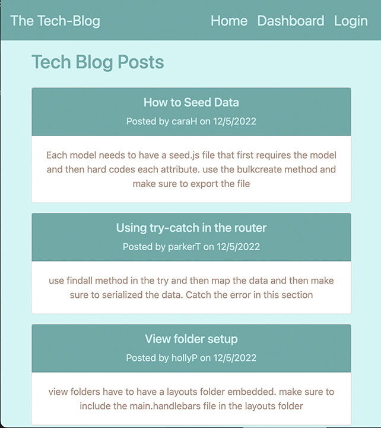
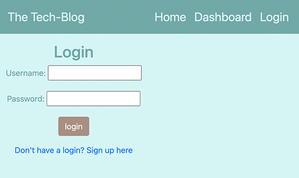
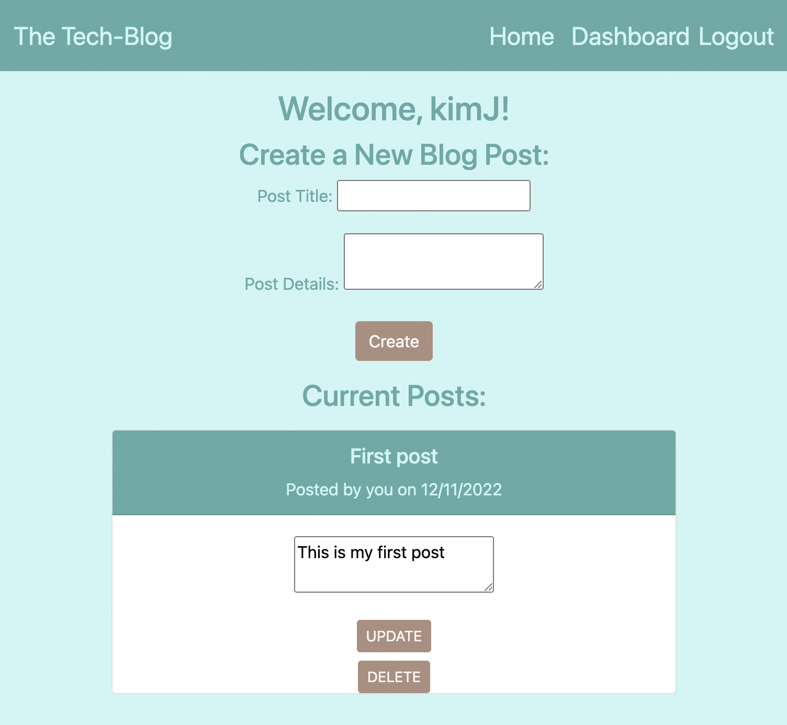
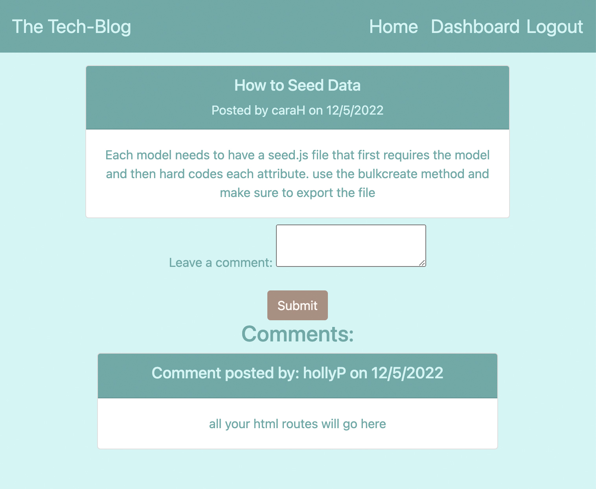

# tech-blog
A CMS-Style Blog site where developers can publish their blog posts and comment on other developers’ posts.

UCLA Bootcamp Challenge - Module 14

## User Story

```md
AS A developer who writes about tech
I WANT a CMS-style blog site
SO THAT I can publish articles, blog posts, and my thoughts and opinions
```

## Acceptance Criteria
- When I visit the site for the first time I am presented with a homepage with existing blog posts with username of the developer and date it was created.
- navigation link to home, dashboard and login
- following image shows site homepage and navigation bar:


- I click on any link other than homepage then I am prompted to either sign up or login per the following image



- I create a username and password and am sent to my dashboard.
- My dashboard reflects a list of blogs I have already posted
- Each blog post gives me the option to either update or delete existing post
- I also have the option to create a new blog post with title and content
- My dashboard can look like the following page:


- Once I go back to the homepage I see my blog post has been added to the list of current posts.
- I can click on any post on the homepage and be taken to the post page
- I am given an option to add a comment on the blog
- the comment will be posted to the individual blog page with my username and date of the comment per the followimg image:



- Since I am logged in the navigation bar has the option for logout

## Deployed Application

You can view the Tech-Blog deployed on [Heroku](https://peaceful-caverns-40849.herokuapp.com)

Repository for the Tech-Blog can be found at: [GitHub](https://github.com/Me-ross/tech-blog)